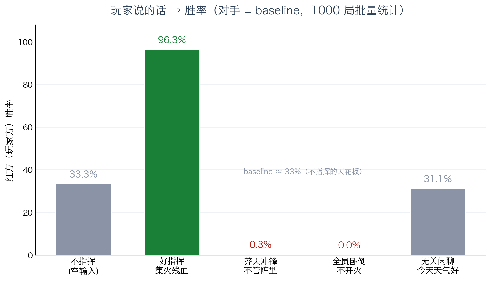
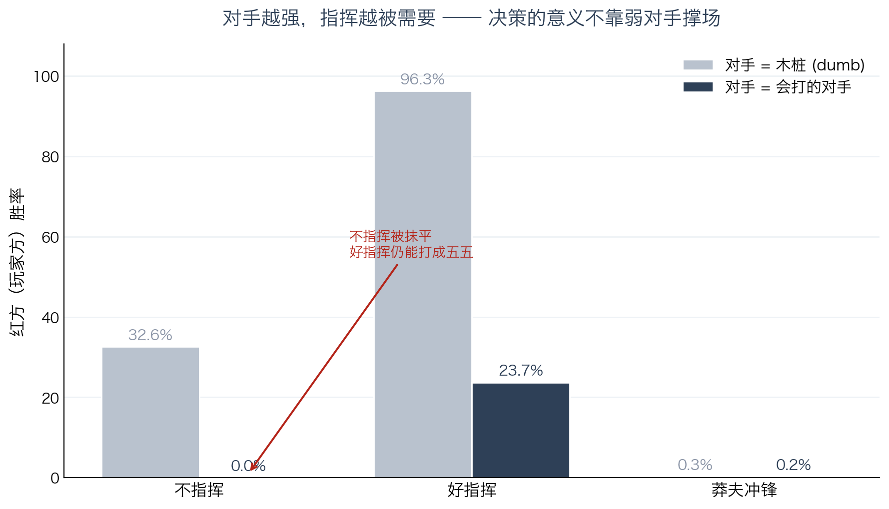
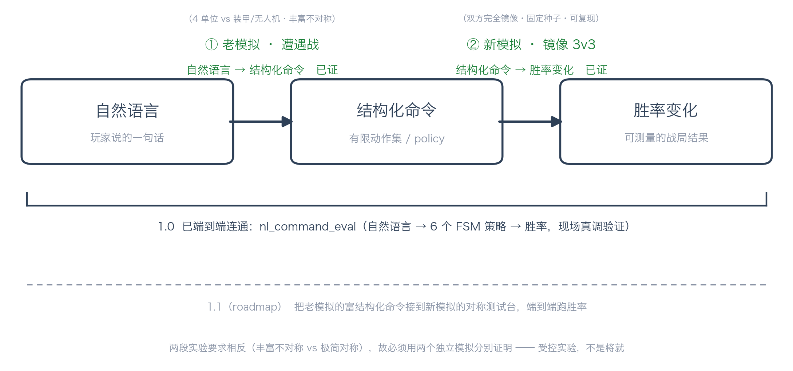

# Real-Time Commander Demo

**把传统自动战斗升级成代理指挥官，同时保留玩家一句话接管关键指挥的能力。**

一个针对「自然语言指挥是否能成为战斗系统交互层」的最小可证原型。

[](https://github.com/Corrame/real-time-commander-demo/actions/workflows/self-check.yml)


[](https://corrame.github.io/real-time-commander-demo/)

---

## Quick links

- [Web demo](https://corrame.github.io/real-time-commander-demo/)
- [1.0 Evidence](docs/1.0_EVIDENCE.md)
- [Robustness check](docs/1.0_EVIDENCE_ROBUSTNESS.md)
- [Authorship / proof note](docs/AUTHORSHIP.md)
- [Self-check](scripts/self_check.py)

---

## 问题

少前2的战斗有一个病：它看起来想做出 XCOM 式的战术决策层，但手操成本太高，玩家很容易退回自动战斗。决策层存在，但没有真正进入玩家体验。

《圣兽之王》有一个对称的病：编队、预设和策略系统很深，但难度压力不够，照推荐方案也能过。深度存在，但没有被充分需要。

两个病，殊途同归：**战斗系统里明明存在决策，但玩家没有以低成本、高反馈的方式真正参与进去。**

---

## 三种模式

### 一、纯规则自动战斗

碾压局、日常本、低压副本，不需要任何 LLM。直接状态机跑即可。

### 二、玩家自然语言指挥

玩家可以直接下一句话：

> 集火残血，前排顶住。

系统映射成角色状态机指令：

```
玩家命令 → 命令编译器 → 状态机
```

玩家本人就是指挥官，不再经过一层战术 AI。

### 三、战术 AI 代理指挥

玩家不想操作时，战术 AI 替代传统自动战斗，读取战场状态，像代理指挥官一样下命令：

```
战场状态 → 战术 LLM → 战术命令 → 命令编译器 → 状态机
```

传统自动战斗是"角色自己按规则打"。代理指挥是"系统先判断战局，再给角色下命令"。

---

## 证据

在 3v3 镜像小地图上跑了一万局模拟，对手为默认自动战斗：

| 输入 | 胜率 |
|---:|---:|
| 好指挥：集火残血 | **96.3%** |
| 不指挥 | 32.6% |
| 莽夫冲锋 | 0.3% |
| 无关闲聊 | 31.1% |

无关闲聊不会被洗成好策略。错误指挥带来坏结果。正确指挥带来高胜率。

**指挥质量本身会显著改变战局**——这不是"随便输入一句话就赢"。



对手换成会打的策略后，差距仍然成立：不指挥会被压制到 0.0%，有效指挥可与对手打成接近五五。



完整证据与稳健性复测见 [`docs/1.0_EVIDENCE.md`](docs/1.0_EVIDENCE.md) 和 [`docs/1.0_EVIDENCE_ROBUSTNESS.md`](docs/1.0_EVIDENCE_ROBUSTNESS.md)。

---

## 1.0 证明边界

当前 1.0 证明的是：**玩家自然语言指挥能够稳定映射到有限战术 policy，并显著改变模拟结果。**

README 提到的「战术 AI 代理指挥」是下一阶段目标——要求 LLM 读取战场状态并动态连续下令，而不仅是把玩家一句话分类成一个固定 policy。当前代码已验证「命令解释器 + 状态机」这半条链路成立。

---

## Visual Proof

网页 demo 用左右对照展示自然语言指挥和 baseline 的行为差异（网页动画用于 visual proof，权威统计以 Python 模拟器输出为准）：

<!-- TODO: add docs/assets/web-demo-screenshot.png after capturing the web demo -->



```
# 静态模式（无需 LLM，内置 5 个预置场景）
python3 -m http.server 8000
# 打开 http://localhost:8000/web/

# 实时 LLM 模式（需要 API key）
python3 scripts/web_server.py --port 8001
# 打开 http://localhost:8001/web/
```

---

## 复现

```bash
pip install -r requirements.txt
cp .env.example .env   # 填入 DEEPSEEK_API_KEY（LLM 部分才需要）
```

零 LLM 自检（3 秒出结果）：

```bash
python3 scripts/self_check.py --runs 500
```

纯规则模拟（无需 LLM）：

```bash
python3 scripts/mirror_map_sim.py --runs 10000 --jitter 1 --red-policy good_focus --blue-policy dumb
```

自然语言 → 胜率评估（需要 LLM）：

```bash
python3 scripts/nl_command_eval.py --runs 1000
python3 scripts/nl_command_eval.py --command "集火残血，前排顶住。"
```

---

## 成本

按 deepseek-v4-flash 输出价 2 元 / 百万 tokens 粗估：

```
6,300 tokens / 小时 ≈ 0.0126 元 / 小时
20,000 tokens / 小时 ≈ 0.04 元 / 小时
```

主要问题不是 token 成本，而是代理指挥质量、状态机执行稳定性和战术反馈体验。

---

## 验什么

- 代理指挥是否比传统自动战斗更强
- 玩家一句话指挥是否真的有战术反馈
- 角色状态机能否稳定执行命令
- 战术 AI 的判断是否足够像指挥官
- 这套东西能否嵌进少前式战斗系统

---

## 版权边界

本项目是原创玩法机制原型，不使用任何现有 IP 的角色、名称、Logo、美术、音乐、剧情设定、世界观术语或商标。
